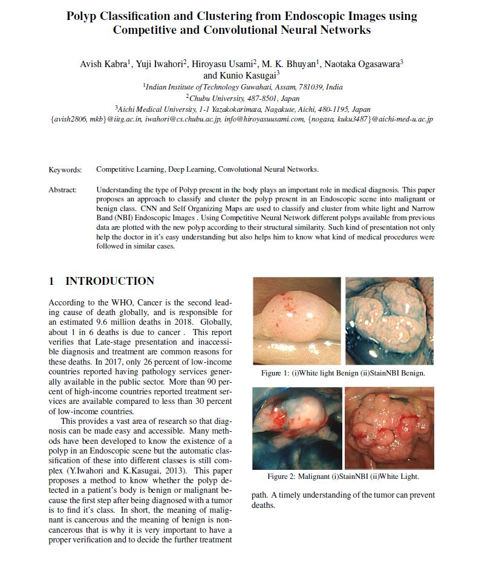

Run the script.py file which is written in python3.
script.py does not take any arguements.
Refer to ICPRAM published paper pdf for theory.

Find Full text at:
https://www.researchgate.net/publication/331775734_Polyp_Classification_and_Clustering_from_Endoscopic_Images_using_Competitive_and_Convolutional_Neural_Networks

Create a folder "2class" with subfolders "Benign" and "malignant" consisting of respective images.

For 2class classification change the parameter in line13 of script.py as "2class" and change it to "4class" for 4 class classification.

